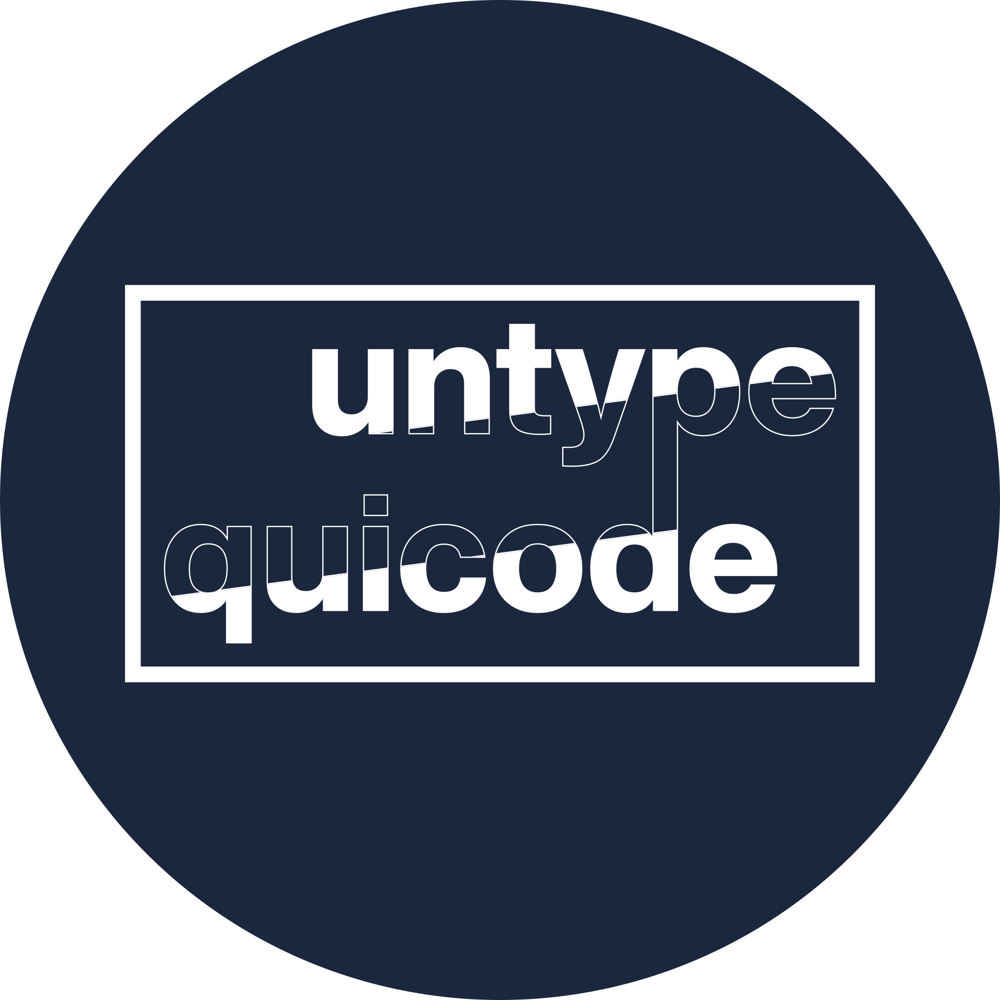

  
  

  <strong>Passionate developer of AI, cybersecurity and cryptography. Creator of mobile apps, mini-games and security programs. Check out my projects on GitHub.

<h3>My favorite projects</h3>

  
  

<h3>My favorite languages</h3>

  

  
<!--
### Hi there 👋

**untypequicode/untypequicode** is a ✨ _special_ ✨ repository because its `README.md` (this file) appears on your GitHub profile.

Here are some ideas to get you started:

- 🔭 I’m currently working on ...
- 🌱 I’m currently learning ...
- 👯 I’m looking to collaborate on ...
- 🤔 I’m looking for help with ...
- 💬 Ask me about ...
- 📫 How to reach me: ...
- 😄 Pronouns: ...
- ⚡ Fun fact: ...
-->
